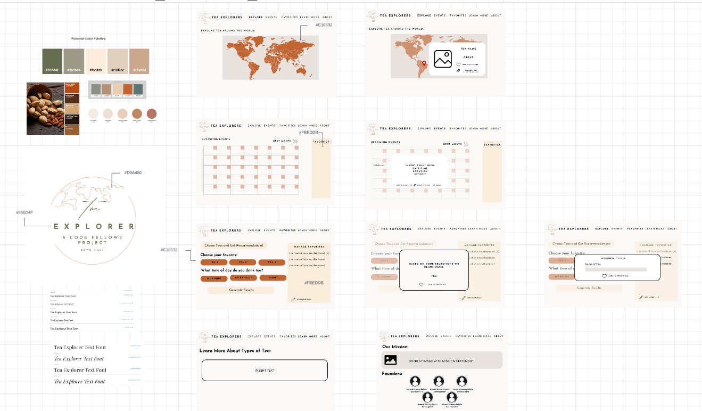

# Tea Explorer by QUICM

[Qilin Xie](https://github.com/QILINXIE02)  
[Ugo Obiako](https://github.com/Ugo-Obiako)  
[Immanuel Shin](https://github.com/ImmanuelShin)  
[Caleb Hemphill](https://github.com/kaylubh)  
[Meg Breen](https://github.com/megrose8) 

## Description

***Work in Progress***

## Problem Domain

  

The Tea Explorer website addresses the consumer pain point of navigating the vast world of teas by providing a concise and informative platform featuring an interactive map. Users can click or hover over continents and countries to discover details about specialized teas. The inclusion of contact information on the second page streamlines the process for users interested in purchasing their preferred teas, offering a centralized source for information.

- [Problem Domain](/problem-domain.md)
- [Requirements](/requirements.md)

## Domain Model & Wire Frame

## Dependencies

`Libraries Used`  
[Library used for Events Calendar](https://github.com/nhn/tui.calendar)  
[Library used for Explore Map](https://www.amcharts.com/javascript-maps/)

`Fonts`  
[Josefin Sans](https://fonts.google.com/specimen/Josefin+Sans)  
[Icons](https://fontawesome.com/)
## Accessibility

### Lighthouse Reports
